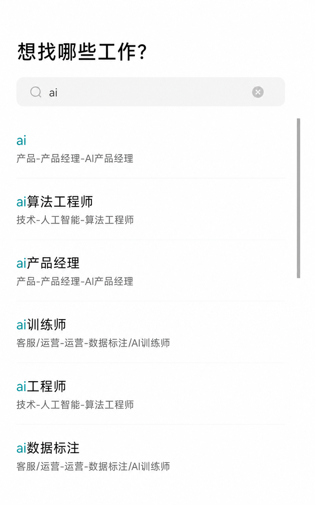

# BOSS 求职辅助工具（清洁分享版）

这是当前修改版源码的使用说明。分享包不包含任何原使用者的 API Key、简历、登录
Cookie、投递日志或简历向量数据。

## Windows 首次使用

需要安装 Python 3.11+、Chrome 和 `uv`。在项目目录打开 PowerShell：

最简单的方式是双击 `启动GUI.cmd`。脚本会在当前电脑上根据 `uv.lock` 创建独立
`.venv`、生成空白个人配置 `.env`，然后启动 GUI。以后仍双击同一个文件即可。

也可以手动执行：

```powershell
uv sync
Copy-Item .env.example .env
uv run python -m boss_zhipin.tauri
```

首次打开后：

1. 在“配置”页选择 LLM 端点，填写自己的 API Key 和模型名。
2. 在“运行”页上传自己的 PDF 简历，并填写自己的 BOSS 求职期望标签。
3. 第一次访问 BOSS 时用自己的账号扫码登录。
4. 先保持 Dry Run，检查匹配结果；确认无误后再取消 Dry Run 正式沟通。

GUI 静态资源已经包含在仓库中，普通使用者不需要安装 Node.js 或 pnpm。

不要从其他电脑复制 `.venv`：虚拟环境含 Python 和 editable install 的绝对路径，
跨用户名、Python 安装位置或系统版本复制后通常无法启动。`.venv` 已被 Git 忽略，
应由每位使用者在自己的电脑上运行 `uv sync --locked` 创建。

## 求职 Tag 怎么填写

“求职 Tag”不是任意搜索关键词，也不是 BOSS 手机端搜索框中出现的职业分类。它对应
BOSS 网页顶部已经创建的**求职期望名称**，工具会在开始运行后尝试切换到这个求职
期望，再读取该频道中的岗位。

推荐配置方式：

1. 先在 BOSS 手机端或网页端创建好求职期望，例如 `Python`、`AI应用开发工程师`。
2. 打开 BOSS 网页职位页，确认顶部能看到这个求职期望，例如 `Python（成都）`。
3. 在 GUI 的“求职 Tag”中填写职位名称部分，例如填写 `Python`，不要附加城市。
4. 开始运行后观察日志。只有出现“目标求职期望已激活”或页面顶部确实切换成功，才
   表示正在处理该 Tag 的岗位；如果日志提示未找到，任务会停止，避免误投推荐频道。

留空时，工具不会主动切换求职期望，而是使用 BOSS 当前的默认推荐 Feed。GUI 当前
填写的 Tag 是本次运行的最高优先级，点击“开始”后会覆盖之前保存的值。

下面截图展示的是 BOSS 手机端可搜索到的职业名称。搜索结果只是创建求职期望时的
候选项；最终应以 BOSS 网页顶部实际显示的求职期望为准。

<p align="center">
  
</p>

> 例如：网页顶部显示 `Python（成都）` 时，GUI 中通常填写 `Python`。不要仅因为
> 手机端能搜到“AI应用开发工程师”，就直接认定网页端已经存在同名求职期望。

## 当前版本的主要行为

- 实际招呼语由使用者自己的 BOSS 账号设置决定；岗位通过筛选后，工具点击“立即沟通”。
- 运行页当前填写的 Tag、最大成功投递数、等待区间和 Dry Run 状态优先于保存值。
- LLM 评分调用或格式解析失败时最多重试 3 次。
- 最大成功投递数由 GUI 直接传入本轮发送循环。
- 点击“立即沟通”确认发送后，会处理“留在此页”弹窗并继续下一岗位。
- 成功投递写入 `logs/applications.csv`，包含公司、职位、完整 JD、匹配分数和招呼语。
- 进度面板会显示每条岗位是否投递、未投递原因和本轮停止原因。

## 个人数据存放位置

以下内容只会在使用者自己的电脑上生成，均已加入 `.gitignore`：

- `.env`：API Key 和个人配置。
- `resume/*.pdf`：个人简历。
- `chrome_profile/`：BOSS 登录 Cookie 和浏览器数据。
- `logs/`：岗位、招聘者、招呼语和投递历史。
- `vectorstores/`：简历文本向量、Chroma 数据库、简历哈希和关键词缓存。

上传 GitHub 前务必运行：

```powershell
git status --short
```

上述个人目录和 `.env` 不应出现在待提交列表中。

## 修改 GUI 后重新构建

只有修改 `tauri-ui/` 前端源码时才需要：

```powershell
cd tauri-ui
pnpm install --frozen-lockfile
pnpm run build
cd ..
```

构建结果会写入 `src/boss_zhipin/tauri/frontend/`。分享版保留这部分静态资源，避免
新用户遇到 `asset not found: index.html`。

## CLI 启动（可选）

```powershell
uv run main.py
```

建议优先使用 GUI；所有个人配置都应由接收者自己填写，不要复制他人的 `.env`、
`chrome_profile`、`resume`、`logs` 或 `vectorstores`。
